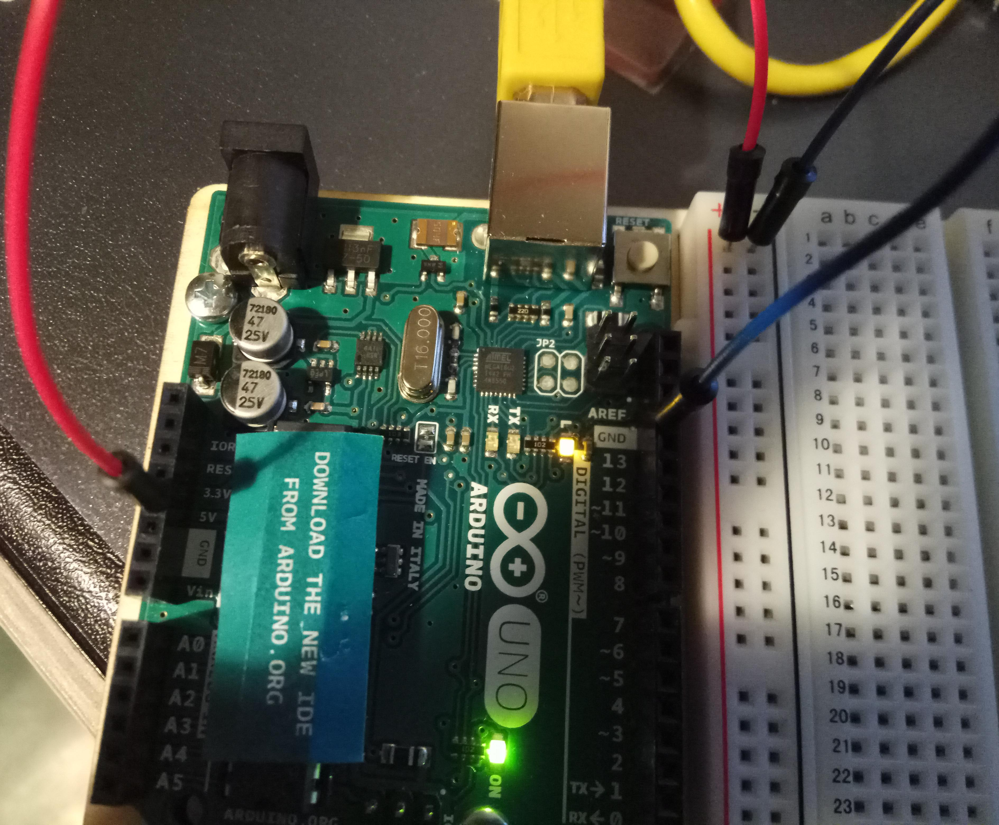

=======
Arduino
=======
Wat is Arduino? Arduino is een micro-computer waarmee je elektronische
komponenten/apparaten (specifiek voor Arduino gemaakt) kan besturen.

Componenten zijn heel divers. Van lampje tot een scherm, van luidspreker tot
een kleine motortje.

In deze cursus gaan we met lampjes werken en een klein beetje met geluid.

De basis (voor deze cursus)
===========================

Arduino
-------
(De board laten zien) bord bestaat uit:

- Stroomaansluiting (aan de stroom aansluiten)
- USB port (informatie uitwisselen met grote computer of als stroom gebruikt)
- Stroom pins (5 Volt, 3.3 Volt)
- Analoge pins (gaatjes die signalen geven)
- Digitale pins (gaatjes die signalen geven)
- AT mega microcontroller (hersenen van de Arduino)

Breadboard
----------
(De board laten zien) bestaat uit... gaatjes. Aan die gaatjes kun je
verschillende componenten aansluiten (bijvoorbeeld lampjes). Denk aan een LEGO
board waarop je verschillende blokken op kan zetten.

Breadboard bestaat uit 30 reijen (van 1 tot 30) en 10 kolommen (van a tot j).

Wat heel belangrijk is om te weten:

- Alle gaatjes van een rei (laten zien), van "a" tot "e" en van "f" tot "j"
  zijn met elkaar verbonden.
- Alle gaatjes van een plusteken kolom ("+") zijn aan elkaar verbonden.
- Alle gaatjes van een minteken kolom ("-") zijn aan elkaar verbonden.
- Linkerkant van de Breadboard is niet aangesloten aan de rechterkant.

Weerstand
---------
Een weerstand vermindert de sterkte van de stroom zodat alle onderdelen de
juiste hoeveelheid stroom krijgen. Denk aan heel klein lampje die ineens
heel veel stroom krijgt. Als zoiets gebeurt, gaat lampje vanzelf
stuk (verbrand). In sommige gevallen kan dat heel gevaarlijk zijn (en het
stinkt ook).

Drukknop
--------
De Drukknop die wij gebruiken maakt contact als er op gedrukt wordt. De
Drukknop heeft 4 pootjes.

LED lampjes
-----------
Als er een klein beetje stroom doorheen loopt geeft de led lampje licht.
Een van de 2 pootjes van elke lampje is langer dan de andere. Langere pootje
staat voor "+". Kortere pootje staat voor "-".

Kabels
------
Met kabels verbind je Arduino board met de Breadboard maar ook een rij
van de Breadboard met een andere rij.

Proefwerken
===========
Voordat je verder gaat:

- Pak een kabel, plug een kant in de "5V" op Arduino board, plug de andere kant
  in een van de "+" gaatjes op de Breadboard.
- Pak een andere kabel, plug een kant in de "GND" op Arduino board, plug de
  andere kant in een van de "-" gaatjes op de Breadboard.

Proefwerk 1 - een lampje laten branden
---------------------------------------
Doel - een lampje permanent (altijd) laten branden.

Stap 1
~~~~~~
Pak een weerstand, plug een kant in een van de "+" gaatjes van de Breadboard.
Plug een andere kant in de gaatje "5a" (rij "5", kolom "a") op de Breadboard.

Stap 2
~~~~~~
Pak een kabeltje, plug een kant in een van de "-" gaatjes van de Breadboard,
plug de andere kant in de gaatje "6c" (rij "6", kolom "c") van de Breadboard.

Stap 3
~~~~~~
Pak een blauwe lampje, plug de langere poot in de gaatje "5e", plug de kortere
poot in de gaatje "6e".

Resultaat
~~~~~~~~~
Als het goed is, staat de lampje wel aan.

Leuk? Ga naar de volgende proefwerk.

Proefwerk 2 - een lampje laten branden pas als je op een knop drukt
-------------------------------------------------------------------
Zullen we een knopje toevoegen? Voor als je op de knopje drukt, dan pas
laten de lampje branden.

Stap 1
~~~~~~
Plug de lampje uit de Breadboard (vanuit "5e" en "6e").

Stap 2
~~~~~~
Plug de kabeltje uit de gaatje "6c" van de Breadboard en plug hem in de gaatje
"8a.

Stap 3
~~~~~~
Pak een Drukknop en plug de 4 pootjes in de "5e", "5f", "7e" en "7f" van de
Breadboard. Daarmee verbind je rij 5 met rij 7. Het stroom zou dus nu in de
rij 7 zijn als de Drukknop gedrukt zou zijn.

Stap 4
~~~~~~
Pak een LED lampje, plug de lange poot in de gaatje "7c", plug de korte poot in
de gaatje "8c".

Stap 5
~~~~~~
Druk op de Drukknop.

Resultaat
~~~~~~~~~
Als het goed is, staat de lampje wel aan.

Leuk? Ga naar de volgende proefwerk.

Proefwerk 3 - meerdere lampjes laten branden
---------------------------------------------
Stap 1
~~~~~~
Haal alles uit behalve kabels die vanuit Arduino naar de Breadboard gaan.

Stap 2
~~~~~~
Pak een weerstand, plug een kant in een van de "+" gaatjes van de Breadboard.
Plug een andere kant in de gaatje "5a" (rij "5", kolom "a") op de Breadboard.

Stap 3
~~~~~~
Pak een kabeltje, plug een kant in een van de "-" gaatjes van de Breadboard,
plug de andere kant in de gaatje "6c" (rij "6", kolom "c") van de Breadboard.

Stap 4
~~~~~~
Pak een blauwe lampje, plug de langere poot in de gaatje "5e", plug de kortere
poot in de gaatje "6e".

Stap 5
~~~~~~
Pak een weerstand, plug een kant in een van de "+" gaatje's van de Breadboard.
Plug een andere kant in de gaatje "14a" (rij "14", kolom "a") op de Breadboard.

Stap 6
~~~~~~
Pak een kabeltje, plug een kant in een van de "-" gaatje's van de Breadboard,
plug de andere kant in de gaatje "15c" (rij "15", kolom "c") van de Breadboard.

Stap 7
~~~~~~
Pak een rode lampje, plug de langere poot in de gaatje "14e", plug de kortere
poot in de gaatje "15e".

Stap 8
~~~~~~
Pak een weerstand, plug een kant in een van de "+" gaatje's van de Breadboard.
Plug een andere kant in de gaatje "23a" (rij "23", kolom "a") op de Breadboard.

Stap 9
~~~~~~
Pak een kabeltje, plug een kant in een van de "-" gaatjes van de Breadboard,
plug de andere kant in de gaatje "24c" (rij "24", kolom "c") van de Breadboard.

Stap 10
~~~~~~~
Pak een gele lampje, plug de langere poot in de gaatje "23e", plug de kortere
poot in de gaatje "24e".

Resultaat
~~~~~~~~~
Als het goed is, staat de lampje wel aan.

Leuk? Ga naar de volgende proefwerk.

Proefwerk 4 - een lampje laten branden en een beetje programmeren
-----------------------------------------------------------------
Lampjes aansluiten aan pins 2, 3, 4, 5 en 6 en laten in achter elkaar branden.

Proefwerk 5 - Super Mario muziek laten uitspelen
------------------------------------------------
Luidspreker aansluiten aan pin 3 en super mario muziek laten spelen.
